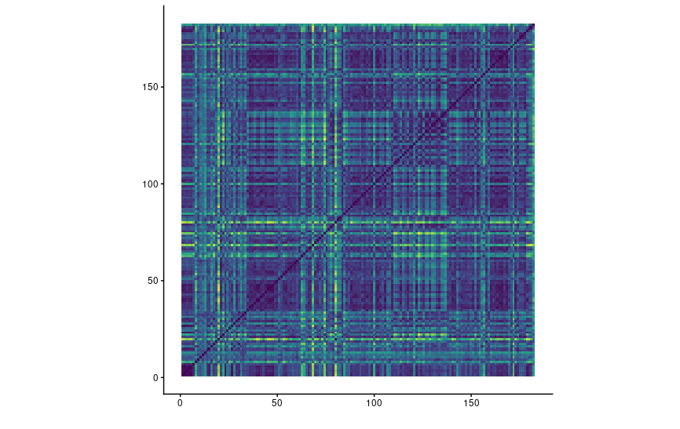

# CompMus
My project for Computational Musicolagy

### voor alles bang - Sef

**Timbre Self-Similarity Matrix**

library(tidyverse)
library(compmus)
library(tidymodels)
library(ggdendro)

Emma_top_songs$'Release Date' <- NULL
Lance_top_songs$'Release Date' <- NULL
spotify_blend$'Release Date' <- NULL

cara |>
  compmus_wrangle_chroma() |> 
  mutate(pitches = map(pitches, compmus_normalise, "euclidean")) |>
  compmus_gather_chroma() |> 
  ggplot(
    aes(
      x = start + duration / 2,
      width = duration,
      y = pitch_class,
      fill = value
    )
  ) +
  geom_tile() +
  labs(x = "Time (s)", y = NULL, fill = "Magnitude") +
  theme_minimal() +
  scale_fill_viridis_c()
  
compmus_long_distance(
  voor_alles_bang |> 
    compmus_wrangle_chroma() |> 
    mutate(pitches = map(pitches, compmus_normalise, "chebyshev")) |> 
    filter(row_number() %% 50L == 0L),
  voor_alles_bang |> 
    compmus_wrangle_chroma() |> 
    mutate(pitches = map(pitches, compmus_normalise, "chebyshev")) |> 
    filter(row_number() %% 50L == 0L),
  feature = pitches,
  method = "euclidean"
) |>
  filter(!is.nan(d)) |> 
  ggplot(
    aes(
      x = xstart + xduration / 2,
      width = 50 * xduration,
      y = ystart + yduration / 2,
      height = 50 * yduration,
      fill = d
    )
  ) +
  geom_tile() +
  coord_equal() +
  labs(x="", y="") +
  theme_minimal() +
  scale_fill_viridis_c(guide = NULL)

voor_alles_bang|> 
  compmus_wrangle_chroma() |> 
  filter(row_number() %% 50L == 0L) |> 
  compmus_match_pitch_template(
    key_templates,         # Change to chord_templates if desired
    method = "cosine",  # Try different distance metrics
    norm = "manhattan"     # Try different norms
  ) |>
  ggplot(
    aes(x = start + duration / 2, width = 50 * duration, y = name, fill = d)
  ) +
  geom_tile() +
  scale_fill_viridis_c(guide = "none") +
  theme_minimal() +
  labs(x = "Time (s)", y = "")

cara_timbre |>
  compmus_wrangle_timbre() |> 
  filter(row_number() %% 50L == 0L) |> 
  mutate(timbre = map(timbre, compmus_normalise, "euclidean")) |>
  compmus_self_similarity(timbre, "cosine") |> 
  ggplot(
    aes(
      x = xstart + xduration / 2,
      width = 50 * xduration,
      y = ystart + yduration / 2,
      height = 50 * yduration,
      fill = d
    )
  ) +
  geom_tile() +
  coord_fixed() +
  scale_fill_viridis_c(guide = "none") +
  theme_classic() +
  labs(x = "", y = "")
  
cara_dft|> 
  pivot_longer(-TIME, names_to = "tempo") |> 
  mutate(tempo = as.numeric(tempo)) |> 
  ggplot(aes(x = TIME, y = tempo, fill = value)) +
  geom_raster() +
  scale_fill_viridis_c(guide = "none") +
  labs(x = "Time (s)", y = "Tempo (BPM)") +
  theme_classic()

both <-
  bind_rows(
    Emma_top_songs |> mutate(Category = "Emma"),
    Lance_top_songs |> mutate(Category = "Lance")
  )
  
both |>
  ggplot(aes(x = Category, y = Speechiness)) +
  geom_violin()

both |>
  ggplot(aes(x = Category, y = Valence)) +
  geom_boxplot()
  
both |>                    # Start with awards.
  mutate(
    Mode = ifelse(Mode == 0, "Minor", "Major")
  ) |>
  ggplot(                     # Set up the plot.
    aes(
      x = Energy,
      y = Danceability,
      size = Loudness,
      colour = Valence
    )
  ) +
  geom_point() +              # Scatter plot.
  geom_rug(linewidth = 0.1) + # Add 'fringes' to show data distribution.
  facet_wrap(~ Category) +    # Separate charts per playlist.
  scale_x_continuous(         # Fine-tune the x axis.
    limits = c(0, 1),
    breaks = c(0, 0.50, 1),   # Use grid-lines for quadrants only.
    minor_breaks = NULL       # Remove 'minor' grid-lines.
  ) +
  scale_y_continuous(         # Fine-tune the y axis in the same way.
    limits = c(0, 1),
    breaks = c(0, 0.50, 1),
    minor_breaks = NULL
  ) +
  scale_color_gradient(low="blue", high="red") +
  scale_size_continuous(      # Fine-tune the sizes of each point.
    trans = "exp",            # Use an exp transformation to emphasise loud.
    guide = "none"            # Remove the legend for size. 
  ) +
  theme_light() +             # Use a simpler theme.
  labs(                       # Make the titles nice.
    x = "Energy",
    y = "Danceability",
    colour = "Valence"
  )

both_clean <- both |>
  group_by(`Track Name`) |>
  filter(n() == 1) |>
  ungroup()

get_conf_mat <- function(fit) {
  outcome <- .get_tune_outcome_names(fit)
  fit |> 
    collect_predictions() |> 
    conf_mat(truth = outcome, estimate = .pred_class)
}  

get_pr <- function(fit) {
  fit |> 
    conf_mat_resampled() |> 
    group_by(Prediction) |> mutate(precision = Freq / sum(Freq)) |> 
    group_by(Truth) |> mutate(recall = Freq / sum(Freq)) |> 
    ungroup() |> filter(Prediction == Truth) |> 
    select(class = Prediction, precision, recall)
}  

both_juice <-
  recipe(
    `Track Name` ~
      Danceability +
      Energy +
      Loudness +
      Speechiness +
      Acousticness +
      Instrumentalness +
      Liveness +
      Valence +
      Tempo +
      `Duration (ms)`,
    data = both_clean
  ) |>
  step_center(all_predictors()) |>
  step_scale(all_predictors()) |> 
  # step_range(all_predictors()) |> 
  prep(both_clean |> mutate(`Track Name` = str_trunc(`Track Name`, 36))) |>
  juice() |>
  column_to_rownames("Track Name")

both_dist <- dist(both_juice, method = "euclidean")

both_dist |>
  hclust(method = "complete") |>
  dendro_data() |>
  ggdendrogram()

both_recipe <-
  recipe(
    Category ~
      Danceability +
      Speechiness +
      Acousticness +
      `Duration (ms)`,
    data = both_clean                    # Use the same name as the previous block.
  ) |>
  step_center(all_predictors()) |>
  step_scale(all_predictors())      # Converts to z-scores.
  # step_range(all_predictors())    # Sets range to [0, 1].

both_cv <- both_clean |> vfold_cv(10)

knn_model <-
  nearest_neighbor(neighbors = 1) |>
  set_mode("classification") |> 
  set_engine("kknn")
both_knn <- 
  workflow() |> 
  add_recipe(both_recipe) |> 
  add_model(knn_model) |> 
  fit_resamples(both_cv, control = control_resamples(save_pred = TRUE))

both_knn |> get_conf_mat()

both_knn |> get_conf_mat() |> autoplot(type = "heatmap")

both_knn |> get_pr()

forest_model <-
  rand_forest() |>
  set_mode("classification") |> 
  set_engine("ranger", importance = "impurity")
both_forest <- 
  workflow() |> 
  add_recipe(both_recipe) |> 
  add_model(forest_model) |> 
  fit_resamples(
    both_cv, 
    control = control_resamples(save_pred = TRUE)
  )

both_forest |> get_pr()  

workflow() |> 
  add_recipe(both_recipe) |> 
  add_model(forest_model) |> 
  fit(both_clean) |> 
  pluck("fit", "fit", "fit") |>
  ranger::importance() |> 
  enframe() |> 
  mutate(name = fct_reorder(name, value)) |> 
  ggplot(aes(name, value)) + 
  geom_col() + 
  coord_flip() +
  theme_minimal() +
  labs(x = NULL, y = "Importance")  

both_clean |>
  ggplot(aes(x = Acousticness, y = Speechiness, colour = Category, size = Danceability)) +
  geom_point(alpha = 0.8) +
  scale_color_viridis_d() +
  labs(
    x = "Acousticness",
    y = "Speechiness",
    size = "Danceability",
    colour = "Playlist"
  )  
  
  
  