# Introduction To My Portfolio


## Column 1 {width="20%"}

### Row 1

::: card
In this portfolio there will trying to check the validity of the Spotify Blend function that Spotify has. This will be done by comparing two playlists of the favorite songs of me (Lance) and my girlfriend (Emma), seeing how they relate and or differ to each other in various ways. And then comparing these playlists to the Blend that Spotify made for us. For the playlists of our favorite songs we use the Your Top Songs 2025 playlist that Spotify makes for you off your most listened to songs of that year.
:::

### Row 2

::: card
The playlist of Lance consist of some afrobeats, but mainly hiphop or rap of which most songs are Dutch, but also American and British.
The playlist of Emma consist mainly of indie Italian, with a mix of pop international songs. 
:::

## Column 2 {width="80%"}

### Row 1

::: card
{width="50%"}
:::

::: card
{width="50%"}
:::


### Row 2

::: card
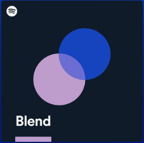{width="25%"}
:::


# Overall comparison

## Column 1 {.tabset width="70%"}

### Combined Graph

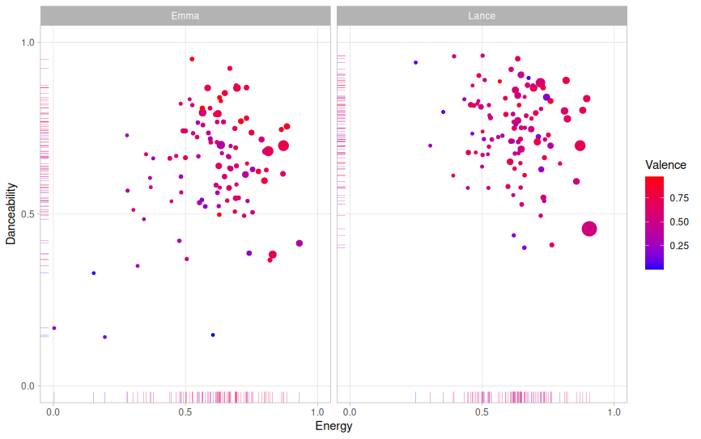{width="70%"}

### Danceability

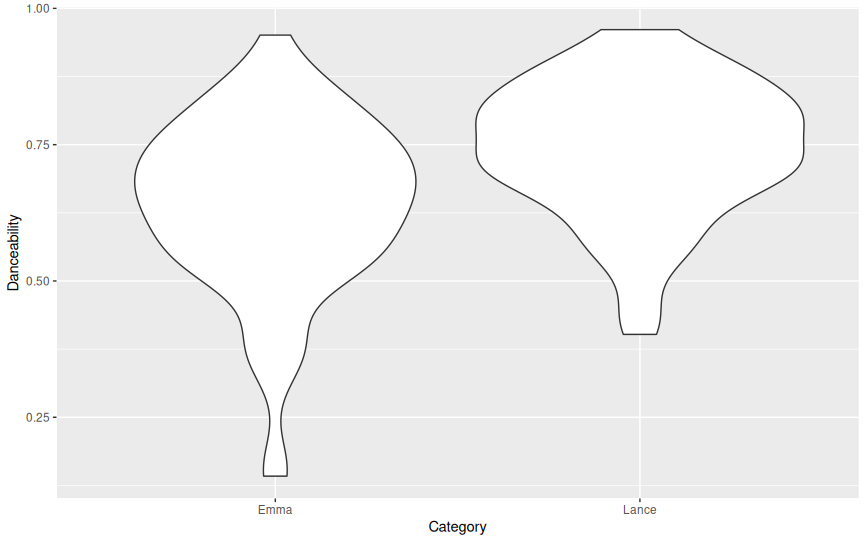{width="70%"}

### Energy


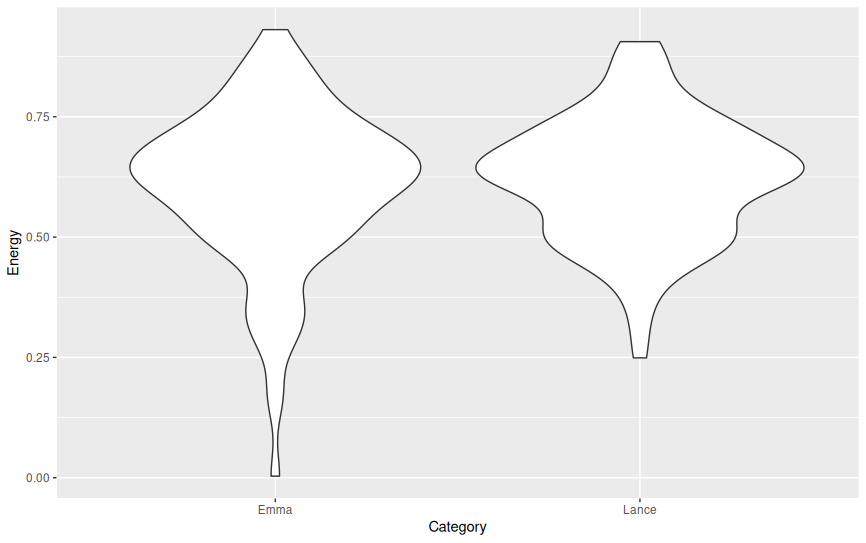{width="70%"}

### Valence

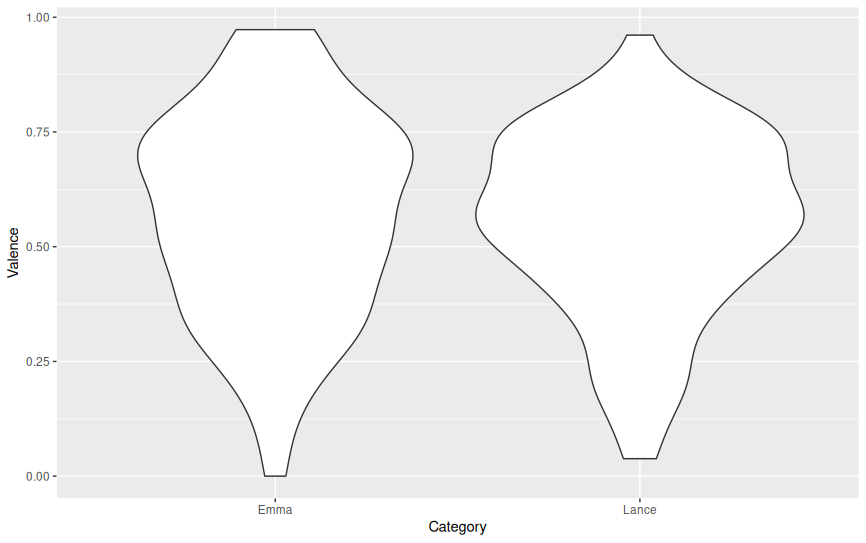{width="70%"}

### Speechiness

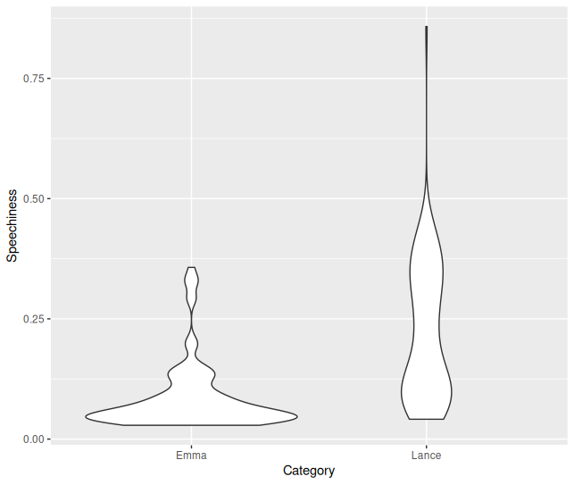


## Column 2 {width="30%"}

In these graphs you can see the comparison of the playlist of Emma and Lance. On the first page is the overall graph with the Valence, Energy, Danceability and as size the Loudness. You can clearly see that in the playlist of Lance the majority of songs are higher in Energy and Danceability. The songs in Emma's playlist are on average a bit higher in Valence. Maybe you would expect that because of the higher danceability and energy in the playlist of Lance the valence would also be a bit higher. I think this is not the case because rap has a high energy and sometimes also danceability but is mostly more angry or dark than some of the "lighter" indie songs in the playlist of Emma. 

# Chroma features

## Column 1 {width="20%"}


::: card
In this page we will show the chromagrams of the favorite songs of Emma and Lance. These are **Cara** of *Lucio Dalla* (Emma) and **voor alles bang** of *Sef* (Lance). As you can see both songs have a fairly clear chromogram. In the sense that in both songs in some pitches there is a lot of action, but in some pitches there is barely any. In **Cara** you can see that there is some switch at around 100 seconds, where there was a lot of action on B now it switches to Bb. You can also hear that in the song, that it maybe sounds a bit more sad. From the chromogram it would seem that the song has a A-B-A-B-A theme. We will get back to this when talking about the timbre. The Chroma Self-Similarity Matrix (SSM) of Cara is very messy, only in the beginning there is some sort of patern. In **voor alles bang** you can see that when Sef is rapping the chromogram also seems a bit more messy. Then in the chorus, around 30 seconds, when its electronic music with some singing it gets more specific to certain pitches. Then in the end there is some talking and then a big finale, where you can see that the pitches are very clear and there is basically no noise outside of the main pitches. In the Chroma SSM of **voor alles bang** you can sort of see a patern, almost a checkerboard, that repeats at around 30 seconds, then 75 seconds and then in the end at 130 seconds a very clear checkerboard. 

```{=html}
<iframe style="border-radius:12px"
  src="https://open.spotify.com/embed/track/7uQuSHXICONzPv91hqMBmf"
  width="100%" height="152"
  frameborder="0"
  allowfullscreen=""
  allow="autoplay; clipboard-write; encrypted-media; fullscreen; picture-in-picture">
</iframe>

<iframe style="border-radius:12px"
  src="https://open.spotify.com/embed/track/0lC1IUZXQ6ukTQfSVqCJa3"
  width="100%" height="152"
  frameborder="0"
  allowfullscreen=""
  allow="autoplay; clipboard-write; encrypted-media; fullscreen; picture-in-picture">
</iframe>
```
:::


## Column 2 {width="40%"}

### Row 1 {.tabset}

#### Cara chromogram
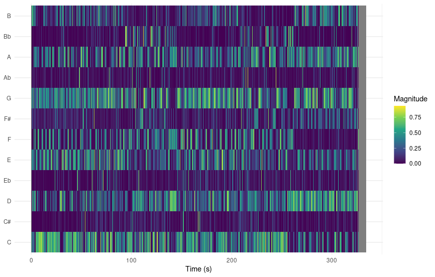{width="75%"}


#### Cara chroma SSM
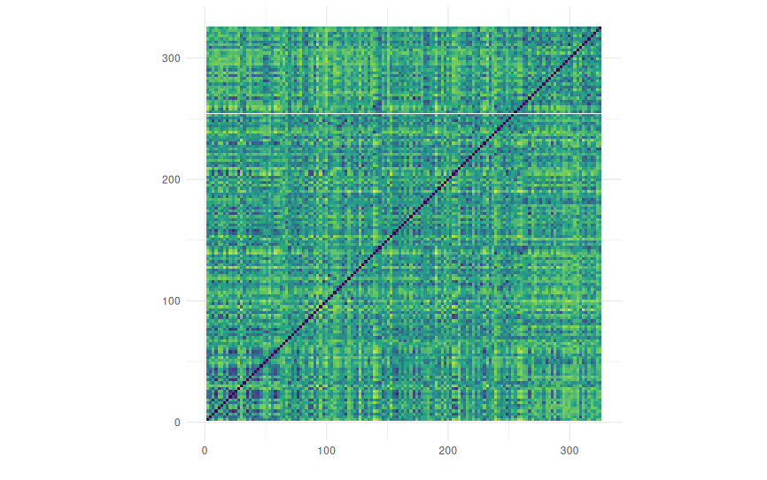{width="75%"}


### Row 2 {.tabset}

#### voor alles bang chromogram
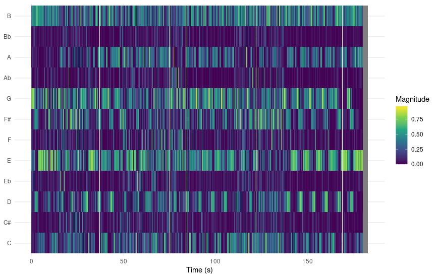{width="75%"}

#### voor alles bang chroma SSM
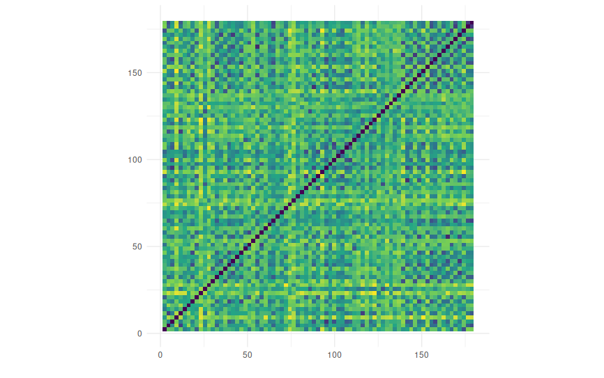{width="75%"}

## Column 3 {width="40%"}

### Chords Cara

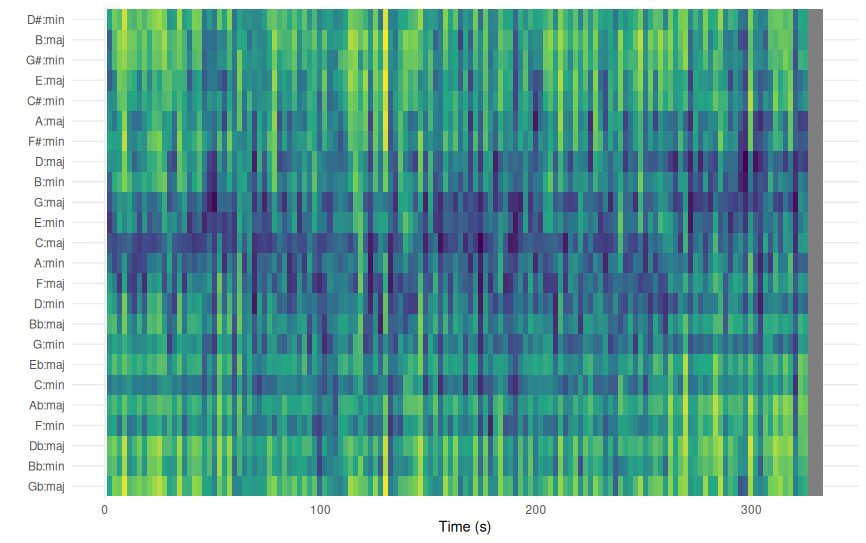

### Chords voor alles bang

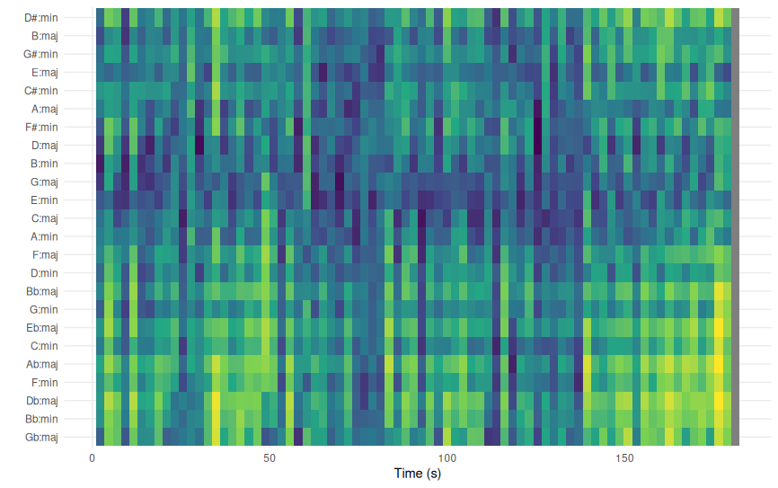


# Timbre

## Column 1 {.tabset width="80%"}

### Cara

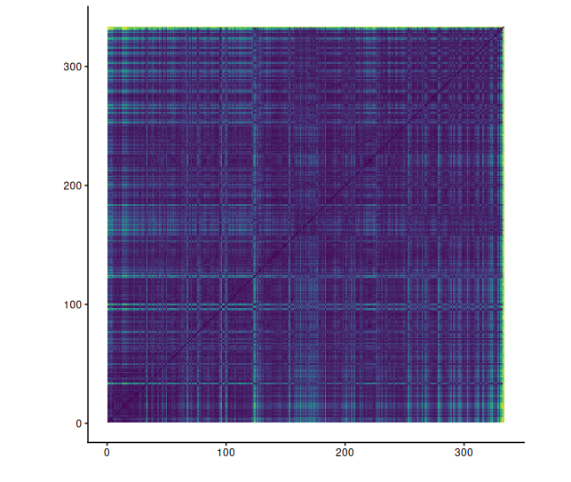

### voor alles bang


## Column 2 {width="20%"}
In the timbre page we can see some details about the "feeling" of the song. With these Self-Similarity Matrices, we can see how the feeling of the song changes in comparison to other parts of the song. With **Cara** it is a bit difficult to see because it seems like the song doesn't really change that much in feeling. This is not necessarily what you hear in the song, so I think there might be something wrong with the graph. I have tried multiple combinations of normalisation and distance, but those don't seem to do much. In the song you can hear some changes in feel in my opinion, which you could also see a bit in the chromogram. Luckely the **voor alles bang** graph does look more like something we can interpret. We can clearly see a checkerboard patern. You can especially see very clearly where the chorus is, at the darker squares. At around 110 seconds there is a break where a woman talks until around 140 seconds, which (eventhough the song is a rap song) does seem different than the rest of the song. 


# Tempograms

## Column 1 {width="20%"}

With the tempograms you can very clearly see that it tends to double the true BPM, at **Cara** it shows that the tempo is most likely 260 BPM. The actual tempo is around 130 BPM. It does also show the true BPM a bit in the graph. With **voor alles bang** it has exactly the same, but it seems like it has a bit more difficulty to predict the true tempo, especialy in the beginning. This might be because the has not come in yet, the music itself is a bit hectic and from the voice the BPM is always hard to infer. Which brings me to the next song **kaya egeo 10** of *Hef*. In this song there is in the beginning only rap with some soft background music. You can see that it really doesn't know what the tempo is. But even when at around 50 seconds the beat does drop come in it still doesn't really know yet. Then at around 80 seconds the beat drops out again, and then it comes back in at 110 seconds, this time without the rapping. Only here the tempo is kind of predicted, but there is still a lot of noise. 


```{=html}
<iframe style="border-radius:12px"
  src="https://open.spotify.com/embed/track/2Z0LqYOAlvyhoOBfOohyV1"
  width="100%" height="152"
  frameborder="0"
  allowfullscreen=""
  allow="autoplay; clipboard-write; encrypted-media; fullscreen; picture-in-picture">
</iframe>
```

## Column 2 {.tabset width="80%"}

### Cara

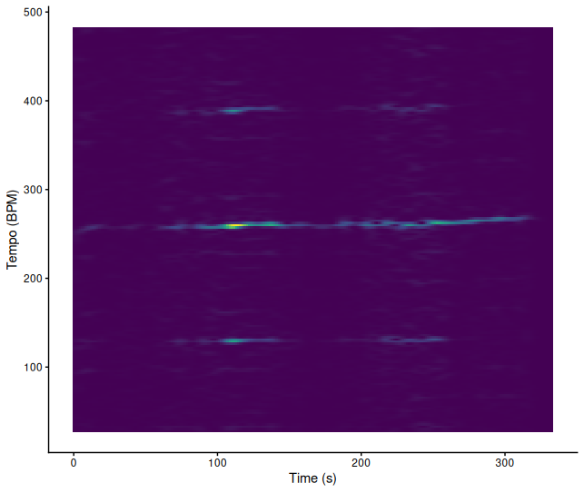


### voor alles bang

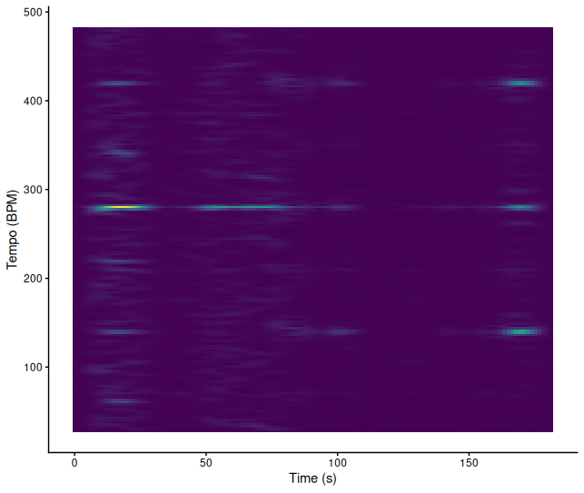

### kaya egeo 10

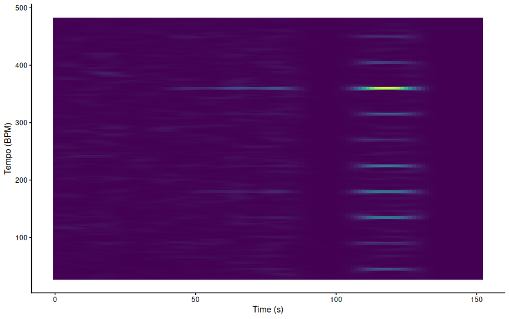

# Classification

## Column {width="30%"}

### Row 

In these final plots you can see that with the KNN the accuracy is quite high, both in recall and in precision it is between 70 and 75 percent. That means it doesn't miss a lot of True Positives and also doesn't have a lot of False Positives. In the most important features you can see that Speechiness is the most important feature. This was as espected, because of the majority of rap songs in the playlist of Lance. After running the KNN again with only the 3 most important features it clearly performs even better. Now the precision and recall is around 80%. In the last plot you can see how the 3 most impactfull features portray against each other. In this plot also the Spotify Blend is included. You can see that some of the Spotify Blend songs are a bit higher in Speechiness to accompany Lance his playlist. But then there are also some songs that are lower in Speechiness and higher in Acousticness. Which lay very close to a lot of Emma her songs.

### Row

In this portfolio you can see that the Spotify Blend clearly tries to take in account the music taste of both listeners. It would be interesting to try this again with two people who have music tastes that are even more apart. Now it seems that the Blend tries to find some songs in between of the two tastes. I wonder if the music taste are very different that the blend would include songs from each taste, or also try to find "new" songs that lay in the middle of each taste. But we can see in this portfolio that it does doe a good job in finding music in both tastes.


## Column {.tabset width="70%"}

### Heatmap KNN without blend


### Most impactfull features

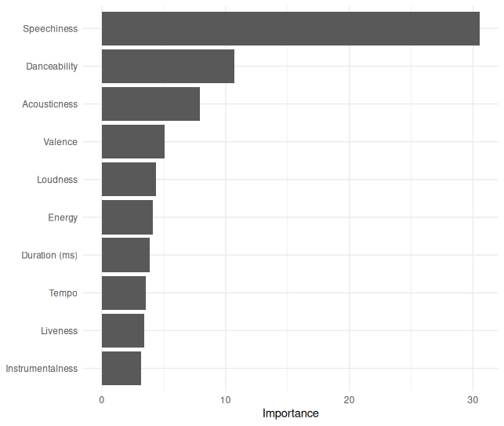

### KNN with only most impactfull features

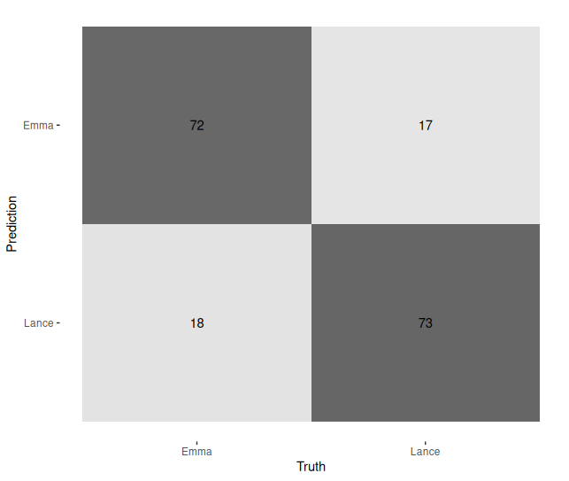


### Plot with most impactfull features

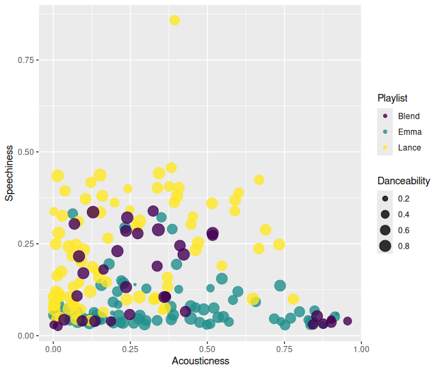


------------------------------------------------------------------------
